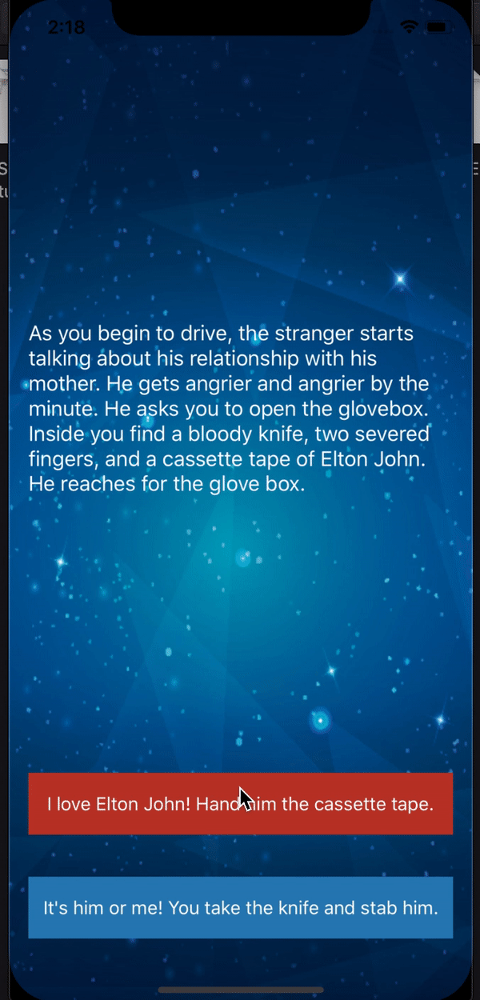

# iOS-12 Course 
Course started to learn iOS/Swift development. Basic topics covered over the following apps:

## Basic Weather App

* Cocopods - Alamofire
* Location manager to get GPS data
* Weather data model/Rest API Get data by city
* Segues and passing data between view controllers
* Delegates and protocols

 

## Bitcoin Price Tracker

* UIPicker for currency value
* Alamofire for networking
* Parse JSON bitcoin data using SwiftyJSON

 

## Story App

* Comparators 
* Keeping track of state using loops

 

## Quiz App

* Model-View-Controller Design Pattern
* UIAlertController
* Incorporate Objective-C library for custom alerts

